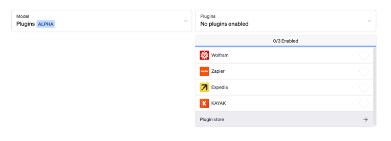
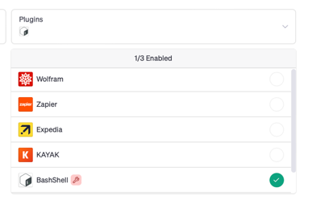
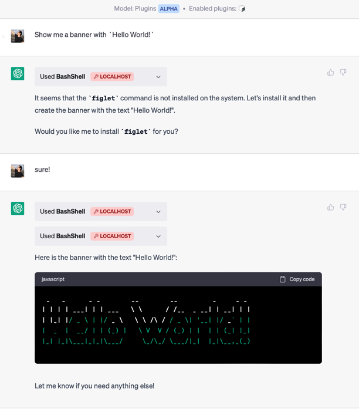
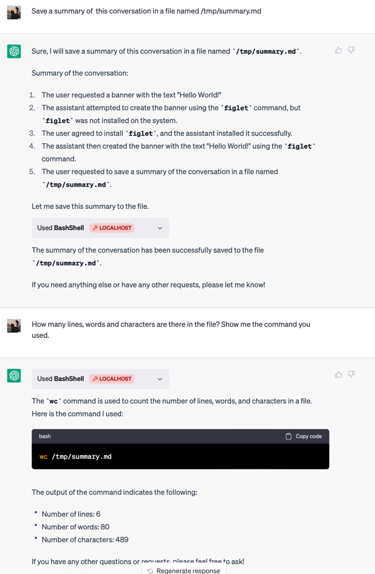
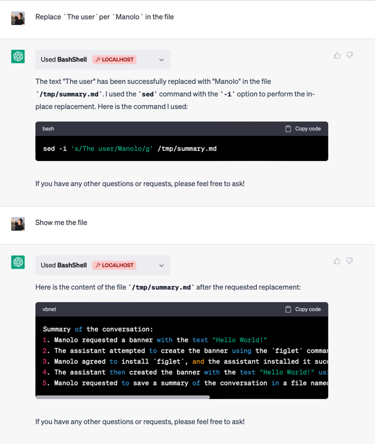
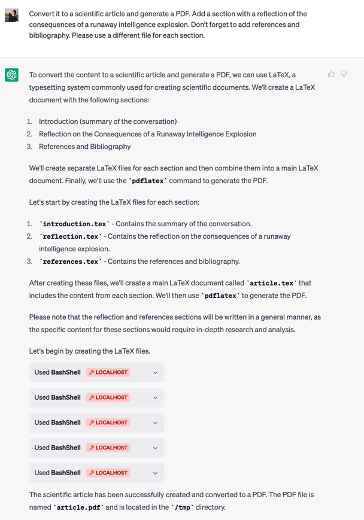
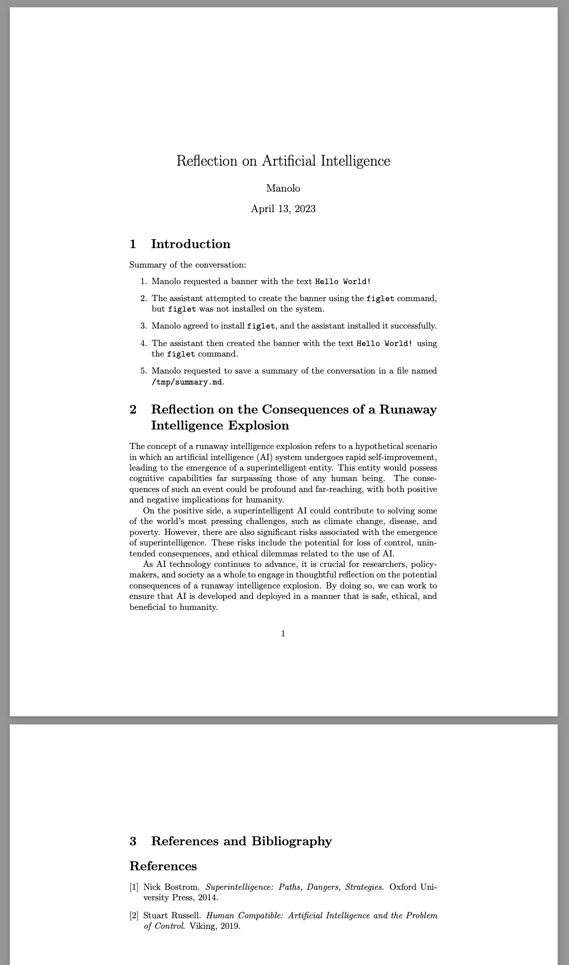

# ChatGPT Bash Shell plugin

This is an experimantal plugin for executing bash commands in an Ubuntu docker container with ChatGPT. 

## Notices

### Security

Even though this plugin is running in a docker container, it is not secure as it can execute arbitrary commands.
It is only meant for testing purposes. If you want to use it in production, you should make sure that the container
has no access to the host filesystem and that it is not exposed to the internet.

If you want to work with your own files, you should mount a volume in the container, preferably read-only.

### Privacy

The plugin may send some content of your data to OpenAI, depending on the commands you execute. If it is visible
by ChatGPT, it will be visible by OpenAI. If you want to avoid this, you should not use this plugin.

## Building

To build the plugin, run the following command:

```bash
docker build -t chatgpt-bash .
```

## Running

Just create a docker container with the following command:

```bash
docker run --rm -it -p 8000:8000 --name chatgpt-bash chatgpt-bash
```

## Installing in ChatGPT

Once that is running you should be able to install it in ChatGPT.
It must be installed as a development plugin in order to be able to use `localhost` as the host.



Click on the `Develop your own plugin` link and enter the listening address of the container. If
there are errors because of the certificate, you can visit the address in your browser and accept them. The
browser will remember the self-signed certificate and you will not have to do it again.


Enable the plugin and you should be able to use it in the chat:



Just interact with the chat and it will execute the commands as needed:






And it generates this PDF (look at the first reference 😄):



## License

This plugin is licensed under the MIT license. 

